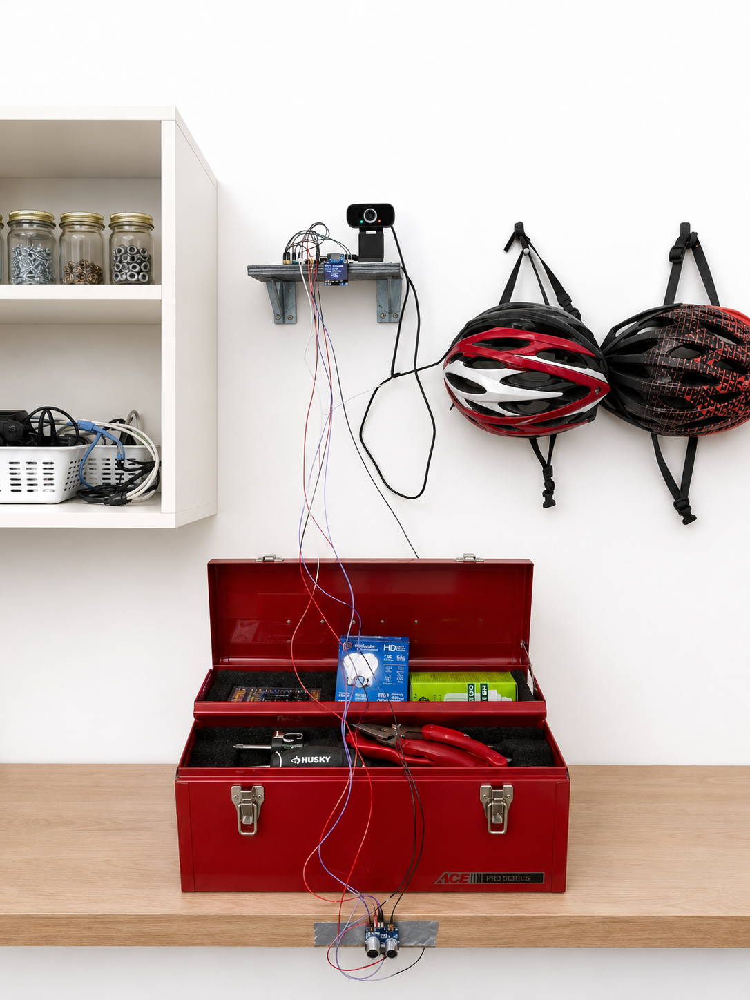
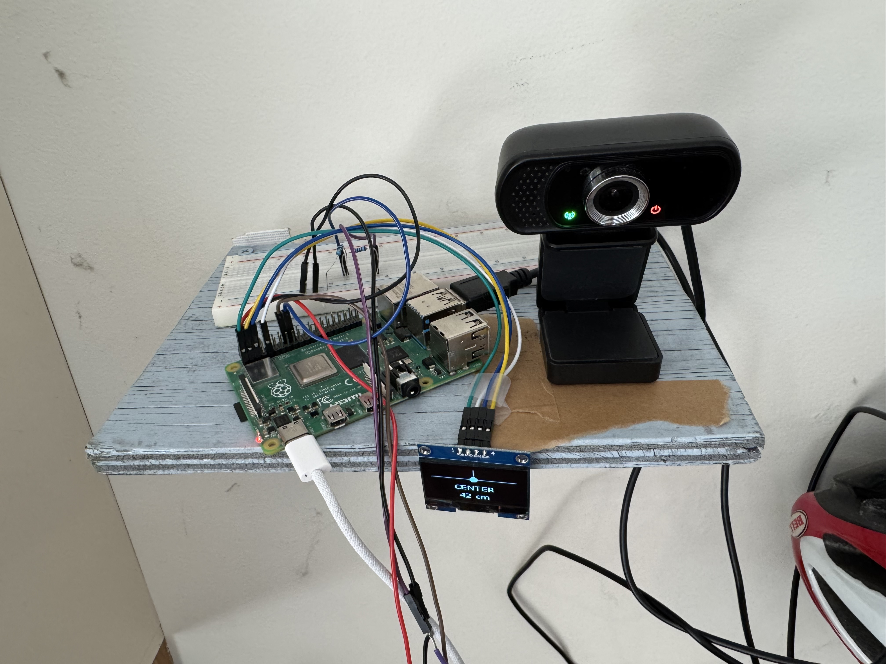
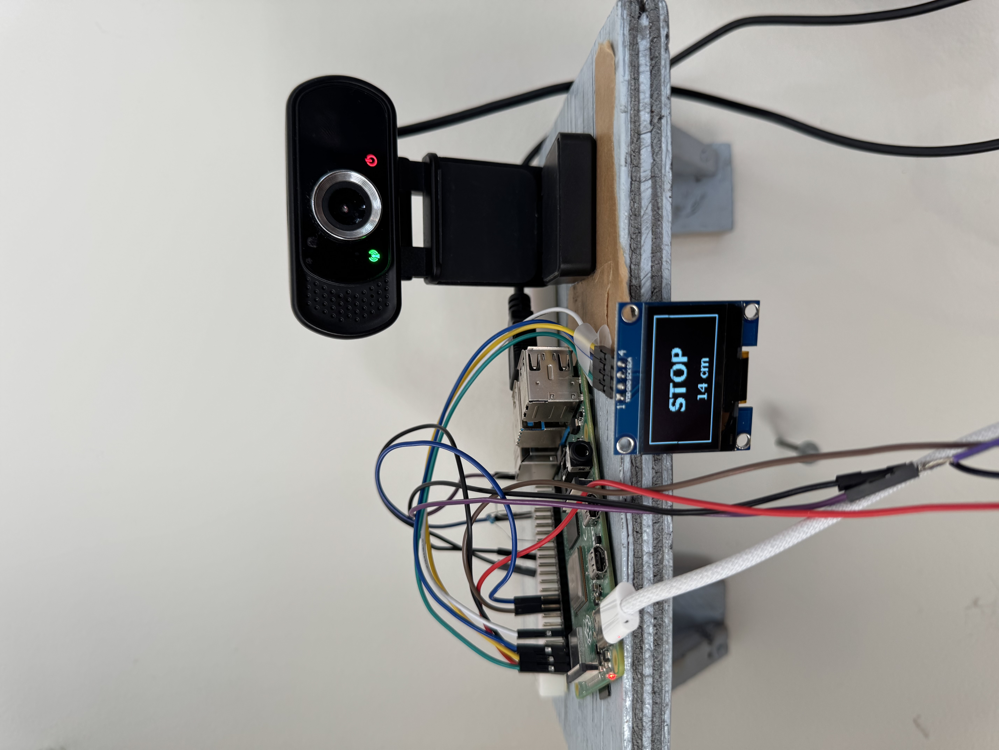

# SmartParker

**Technical description:** A Raspberry Pi parking assistant that fuses YOLOv8 vehicle alignment with ultrasonic distance sensing to provide real-time, calibrated parking guidance on an OLED display and web dashboard.

SmartParker helps a driver position a vehicle accurately and stop at a safe distance in a garage. A USB camera detects the vehicle with an ONNX-exported YOLOv8 Nano model, while an ultrasonic sensor remains the source of truth for stopping distance. The system combines both signals into clear `MOVE LEFT`, `MOVE RIGHT`, `CENTER`, `NO CAR`, and `STOP` guidance.

## Features

- Real-time vehicle detection using YOLOv8 Nano through ONNX Runtime.
- Low-latency threaded camera capture with a one-frame buffer.
- Adjustable left/right camera ROI and center-line calibration.
- HC-SR04-compatible ultrasonic distance sensing.
- 128×64 SH1106 OLED guidance display.
- Flask dashboard with live video, status, and interactive calibration controls.
- Persistent, atomic calibration settings in `config.json`.

## System overview

```text
USB camera ──> YOLOv8 / alignment ─┐
                                  ├──> guidance fusion ──> SH1106 OLED
Ultrasonic sensor ─> distance ────┘                     └──> Flask dashboard
```

## Hardware

- Raspberry Pi with Python 3
- USB camera
- HC-SR04-compatible ultrasonic distance sensor
- 1.3-inch SH1106 I²C OLED display (default address: `0x3C`)

## Setup

```bash
git clone https://github.com/<your-account>/SmartParker.git
cd SmartParker
python3 -m venv venv
source venv/bin/activate
pip install -r requirements.txt
```

The project includes `yolov8n.onnx` for runtime inference and `yolov8n.pt` as the original model artifact. Connect the camera, ultrasonic sensor, and display to match the defaults in the source files before starting the application.

## Run

Start the hardware guidance loop:

```bash
python3 main.py
```

Start the web dashboard and calibration UI:

```bash
python3 app.py
```

Calibration values are saved in `config.json`. The dashboard lets you set the visual center offset and the left/right bounds of the watched parking region.

## Project layout

- `app.py` — Flask dashboard, MJPEG stream, and calibration endpoints.
- `camera.py` — camera capture, ROI handling, YOLO preprocessing/inference, and alignment output.
- `distance_sensor.py` — ultrasonic distance adapter.
- `fusion.py` — combines distance and alignment into guidance states.
- `display.py` — SH1106 OLED renderer.
- `main.py` — standalone hardware control loop.
- `calibration_config.py` / `config.json` — durable calibration configuration.

## Screenshots

Add the following source images from the development Mac to `assets/screenshots/` before publishing a documentation update. They are intentionally excluded from this commit because the files are not available on the Raspberry Pi/session that produced this repository.

| Screenshot | Local macOS source path | Repository destination |
| --- | --- | --- |
| AI-enhanced full view | `/Users/jonleonard/Downloads/SmartParker Full View - AI Enhanced.png` | `assets/screenshots/smartparker-full-view-ai-enhanced.png` |
| Full view | `/Users/jonleonard/Downloads/SmartParker Full View.jpeg` | `assets/screenshots/smartparker-full-view.jpeg` |
| Hardware view | `/Users/jonleonard/Downloads/SmartParker Hardware View.jpeg` | `assets/screenshots/smartparker-hardware-view.jpeg` |
| Screen view | `/Users/jonleonard/Downloads/SmartParker Screen View.jpeg` | `assets/screenshots/smartparker-screen-view.jpeg` |

Once copied into those paths, render them in this section with:

```md




```

## Notes

This project is designed for parking assistance, not autonomous vehicle control. Always remain responsible for vehicle operation and verify hardware readings during installation and calibration.
